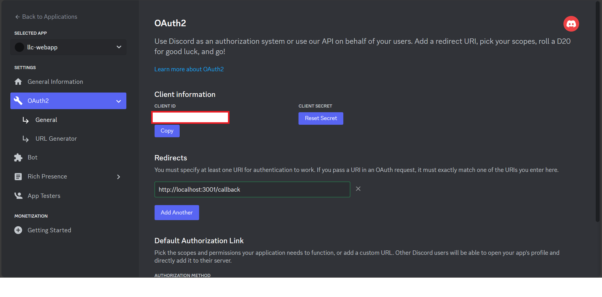

# Cách để sử dụng Discord OAuth2

OAuth2 là một cơ chế xác thực và phân quyền người dùng dựa vào một bên thứ 3 (Ở đây là Discord). 

Để có thể sử dụng Discord OAuth2, cần có những bước sau

0. Tạo tài khoản Discord Developer
1. Tạo một application mới trong Discord 
2. Chọn application vừa mới tạo và vào mục OAuth2
3. Lấy giá trị client_id và client_secret và gán vào file.env
4. Thêm một Redirect URL với giá trị `http://localhost:3001/callback` trong DISCORD_REDIRECT_URI (file .env) và Redirects (OAuth2 -> General)
